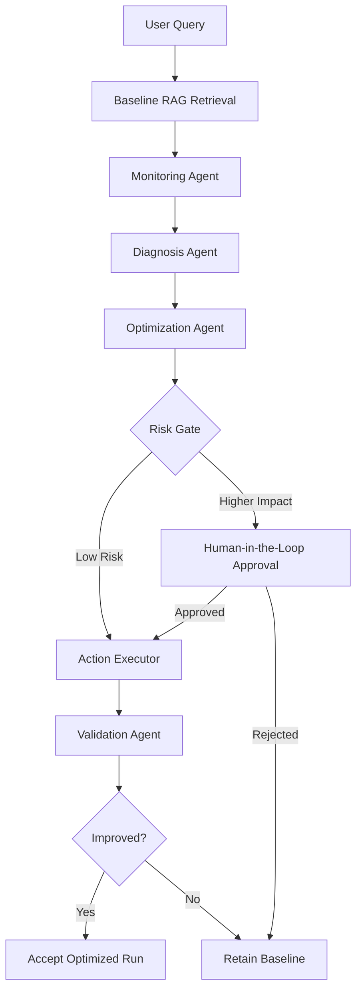

# RAGOps Agent – Multi-Agent Retrieval QA Optimizer

> **Observe. Diagnose. Optimize. Validate.**


**RAGOps Agent** is a multi-agent optimization layer for Retrieval-Augmented Generation (RAG) systems. It monitors retrieval quality, diagnoses why retrieval fails, proposes targeted improvements, applies risk-based Human-in-the-Loop (HITL), and validates whether the change actually improves retrieval before it is accepted.

> **Important:** RAGOps is **not a chatbot**. It is designed to improve the retrieval layer that powers RAG-based AI assistants, helping them retrieve better context and ultimately produce more reliable responses.

---

## Why This Project Exists

A RAG application can still return a weak answer even when the correct information exists in its knowledge base.

The failure may come from the retrieval pipeline rather than the language model itself:

- the right document may fall outside the current **Top-K**
- the user's wording may not match the wording in the knowledge base
- chunks may be too large, too small, or poorly segmented
- an optimization may improve one metric while degrading another

RAGOps treats retrieval quality as an operational problem that can be **observed, diagnosed, improved, and re-evaluated**.

---

## What RAGOps Does

RAGOps adds a controlled optimization workflow around a baseline RAG pipeline:

- **Observe** retrieval behavior and collect evidence
- **Diagnose** the likely root cause of failure
- **Optimize** with a targeted action instead of blind tuning
- **Control** higher-impact changes through risk-based HITL
- **Validate** the candidate configuration against the baseline
- **Accept or reject** the change based on measured retrieval performance

### Core Optimization Targets

1. **Top-K Retrieval**
   - Detects cases where relevant context exists but is ranked outside the active retrieval window.
   - Supports controlled Top-K adjustment when evidence justifies it.

2. **Query Mismatch / Query Rewriting**
   - Detects wording mismatch between a user query and the knowledge base.
   - Tests rewritten queries and compares retrieval outcomes before accepting the change.

3. **Chunking Quality**
   - Evaluates alternative chunk size and overlap configurations.
   - Builds isolated candidate indexes and compares them against the baseline.

---

## Multi-Agent Workflow



---

## Agent Responsibilities

| Agent | Role |
|---|---|
| **Monitoring Agent** | Collects retrieval health signals and identifies suspicious retrieval behavior. |
| **Diagnosis Agent** | Interprets the evidence and identifies the most likely root cause. |
| **Optimization Agent** | Proposes a targeted action such as Top-K adjustment, query rewriting, or re-chunking. |
| **Validation Agent** | Re-runs evaluation and compares candidate performance with the baseline. |
| **HITL Risk Gate** | Requires human approval before higher-impact configuration changes are applied. |

---

## Evaluation Strategy

The system evaluates retrieval quality using:

- **Recall@K** — whether relevant context is retrieved within the top results
- **Precision@K** — how much of the retrieved context is relevant
- **MRR (Mean Reciprocal Rank)** — how early the first relevant result appears

### Current Evaluation Snapshot

The current evaluation set contains **48 queries** across **24 services** from four Saudi digital-service platforms used as a controlled testbed.

| Configuration | Recall@4 | Precision@4 | MRR |
|---|---:|---:|---:|
| **Baseline** | 0.896 | 0.490 | 0.799 |
| **Re-chunk candidate (750 / 150)** | 0.917 | 0.490 | 0.821 |

The current chunking sweep selected the **750-token chunk size / 150-token overlap** candidate as improved under the project's decision policy: prioritize Recall@4, then MRR, then Precision@4.

The query-rewrite probe also demonstrated that targeted rewriting can recover failed retrievals in multiple cases. In the current probe set, **4 of 5 tested queries improved**, while one case remained primarily a Top-K issue.

> These are retrieval-quality metrics for the current testbed and configuration, not model-accuracy claims.

---

## Controlled Testbed

The project uses **Government Digital Services Guidance** only as a test environment for the RAGOps workflow.

The current knowledge base contains **24 services**:

- **Absher** — 6 services
- **Najiz** — 6 services
- **Balady** — 6 services
- **Sakani** — 6 services

This domain was selected because it provides structured, information-rich content that makes retrieval failures measurable and easy to reproduce.

**The project itself is not a government chatbot.**

---

## Technology Stack

### AI / Retrieval
- **Python**
- **Retrieval-Augmented Generation (RAG)**
- **FAISS**
- **LangChain**
- **LangGraph**
- **OpenAI**
- **text-embedding-3-small**

### Agentic Workflow
- Multi-agent orchestration
- Risk-based Human-in-the-Loop
- Candidate isolation
- Retrieval validation
- Before-vs-after evaluation

### Interface & Observability
- **Streamlit**
- **Plotly**
- **LangSmith**

---

## Key Engineering Features

- Baseline RAG retrieval pipeline
- Retrieval health monitoring
- Root-cause diagnosis
- Query rewrite probing
- Top-K optimization proposals
- Chunking parameter sweeps
- Isolated candidate vector indexes
- Human approval for higher-impact actions
- Validation before accepting optimization
- Regression and integration testing
- Retrieval evidence and observability views

---

## Repository Structure

```text
ragops-multi-agent/
├── app.py                 # Streamlit application entry point
├── frontend/              # UI, dashboards, evidence and presentation layers
├── evaluation/            # Evaluation datasets and experiment results
├── knowledge_base/        # Testbed service guidance
│   ├── absher/
│   ├── najiz/
│   ├── balady/
│   └── sakani/
├── scripts/               # Retrieval, agents, validation and regression scripts
├── vector_store/          # Baseline and candidate FAISS indexes
├── requirements.txt
├── .env.example
└── README.md
```

---

## Run Locally

### 1. Clone the repository

```bash
git clone https://github.com/Ghala-ai-hub/ragops-multi-agent.git
cd ragops-multi-agent
```

### 2. Create and activate a virtual environment

```bash
python -m venv .venv
```

Windows:

```bash
.venv\Scripts\activate
```

macOS / Linux:

```bash
source .venv/bin/activate
```

### 3. Install dependencies

```bash
pip install -r requirements.txt
```

### 4. Configure environment variables

Copy `.env.example` to `.env` and add your OpenAI API key:

```text
OPENAI_API_KEY=your_openai_api_key_here
LANGSMITH_TRACING=false
LANGSMITH_API_KEY=
LANGSMITH_PROJECT=ragops-multi-agent
```

### 5. Run the application

```bash
streamlit run app.py
```

---

## Project Context

RAGOps Agent was developed as a **team project** during the **Saudi Digital Academy (SDA) Agentic AI Engineering Program**, in collaboration with **WeCloudData**.

The project focuses on practical Agentic AI engineering: using specialized agents, measurable retrieval evidence, controlled optimization, and Human-in-the-Loop decision points to make RAG systems more reliable.

---

## Project Status

The current version includes the end-to-end RAGOps workflow, retrieval evaluation, diagnosis logic, optimization proposals, HITL execution, validation, LangGraph orchestration, frontend components, observability support, and regression testing.

Further work can extend the system with additional retrieval failure modes, broader evaluation sets, production deployment controls, and more automated observability.

---

## Author

**Ghala Bander Alsuna Allah**  
Artificial Intelligence Graduate | AI Engineer  
[LinkedIn](https://www.linkedin.com/in/ghala-bander-alsuna-allah) · [GitHub](https://github.com/Ghala-ai-hub) · [Portfolio](https://ghala-ai-hub.github.io)
